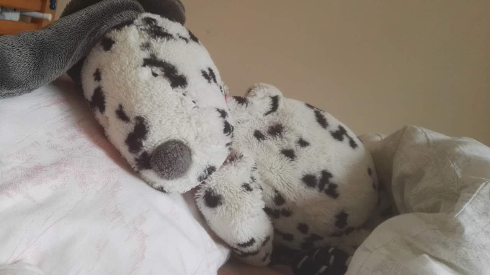

## LUPING XIANG #

received the B.Eng. (Hons.) degree from Xiamen University, China, in 2015. 
He is currently pursuing the Ph.D. degree with the Southampton Wireless Group, University of
Southampton. His research interests include fully parallel turbo coding algorithm.
--<a href="materials/luping-CV.pdf">Here is my CV</a>.

## ...this blog #

I write this blog because I want to share what I have learned and keep going.

